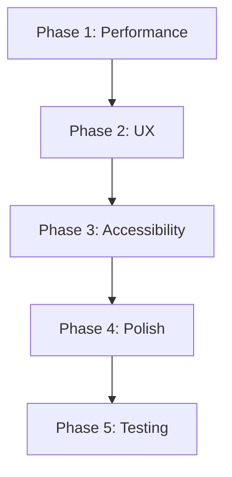

# 🎯 Frontend Improvement Plan v1.0 - TB Group

**Дата:** 2025-11-11
**Проект:** TB Group Корпоративный сайт
**Текущий статус:** Все критичные баги исправлены ✅
**Цель:** Оптимизация и улучшение пользовательского опыта

---

## 📊 Current State Assessment

### ✅ Strengths
- All P0 critical bugs resolved
- Site loads successfully (localhost:3001)
- Production build: 167 kB (good)
- TypeScript: 0 errors
- APIs functional: Contact & Newsletter
- Responsive design working
- Modern tech stack: Next.js 14, TypeScript, Tailwind, Framer Motion

### ⚠️ Areas for Improvement
- Image optimization not implemented
- No error boundaries for graceful failures
- Missing service worker for offline support
- Limited accessibility features
- No comprehensive test suite
- Performance metrics not measured

---

## 🎯 Improvement Goals

### Performance Targets
```
Current → Target
First Load: 167 kB → <150 kB (10% reduction)
LCP: Unknown → <2.5s
CLS: Unknown → <0.1
FID: Unknown → <100ms
```

### Quality Targets
```
TypeScript: ✅ 0 errors → Maintain
ESLint: ❓ → 0 warnings
Test Coverage: 0% → 70%+
Accessibility: Partial → WCAG AA
```

### User Experience Targets
```
Page Load: 2-3s → <2s
Form UX: Basic → Professional with validation
Mobile: Good → Excellent
Accessibility: Basic → Full keyboard navigation
```

---

## 🗓️ Implementation Phases

### Phase 1: Performance & Quick Wins
**Duration:** 1-2 days
**Priority:** HIGH
**Impact:** HIGH

#### 1.1 Image Optimization
**Task ID:** FP-1.1
**Files to modify:**
- `apps/web/next.config.js`
- `apps/web/src/components/sections/Hero.tsx`
- `apps/web/src/components/blog/BlogPreview.tsx`

**Actions:**
```bash
# 1. Add image optimization config
# 2. Convert og-image.jpg to WebP
# 3. Implement next/image for all images
# 4. Add blur placeholders
```

**Acceptance Criteria:**
- [ ] WebP format used for all images
- [ ] next/image component implemented
- [ ] Image sizes optimized
- [ ] Bundle size reduced by 10-15 kB

#### 1.2 Error Boundaries Implementation
**Task ID:** FP-1.2
**Files to create/modify:**
- `apps/web/src/components/ui/ErrorBoundary.tsx` (already exists - enhance)
- `apps/web/src/app/layout.tsx`

**Actions:**
```typescript
// 1. Enhance ErrorBoundary component
// 2. Add error tracking (Sentry or similar)
// 3. Add fallback UI for errors
// 4. Wrap all lazy-loaded components
```

**Acceptance Criteria:**
- [ ] Error boundary wraps all major sections
- [ ] Graceful error handling in production
- [ ] Error logging implemented
- [ ] User-friendly error messages

#### 1.3 Font Optimization
**Task ID:** FP-1.3
**Files to modify:**
- `apps/web/src/app/layout.tsx`
- `apps/web/next.config.js`

**Actions:**
```typescript
// 1. Move to next/font for all fonts
// 2. Add font preloading
// 3. Optimize font display
// 4. Remove external font CSS
```

**Acceptance Criteria:**
- [ ] All fonts use next/font
- [ ] No external font requests
- [ ] Font loading optimized
- [ ] CLS improved

---

### Phase 2: User Experience Enhancements
**Duration:** 2-3 days
**Priority:** HIGH
**Impact:** HIGH

#### 2.1 Smooth Scrolling & Navigation
**Task ID:** FP-2.1
**Files to modify:**
- `apps/web/src/components/layout/Header.tsx`
- `apps/web/src/components/sections/Hero.tsx`
- `apps/web/tailwind.config.js`

**Actions:**
```typescript
// 1. Add smooth scroll behavior
// 2. Implement scroll spy for navigation
// 3. Add progress indicator
// 4. Improve section transitions
```

**Acceptance Criteria:**
- [ ] Smooth scrolling between sections
- [ ] Active section highlighted in nav
- [ ] Scroll progress indicator
- [ ] Works on mobile and desktop

#### 2.2 Enhanced Form UX
**Task ID:** FP-2.2
**Files to modify:**
- `apps/web/src/components/SimpleContactForm.tsx`
- `apps/web/src/components/ui/NewsletterSubscription.tsx`
- `apps/web/src/app/contact/page.tsx`

**Actions:**
```typescript
// 1. Add real-time validation
// 2. Implement progress indicators
// 3. Add success animations
// 4. Improve error messages
// 5. Add form auto-save
```

**Acceptance Criteria:**
- [ ] Real-time validation feedback
- [ ] Loading states for all actions
- [ ] Success animations
- [ ] Clear error messages in Russian
- [ ] Form data persists on errors

#### 2.3 Skeleton Screens
**Task ID:** FP-2.3
**Files to create:**
- `apps/web/src/components/ui/Skeleton.tsx`
- Update: `apps/web/src/components/ui/LazyLoadWrapper.tsx`

**Actions:**
```typescript
// 1. Create reusable Skeleton components
// 2. Add skeleton for all lazy content
// 3. Match actual content layout
// 4. Add shimmer effects
```

**Acceptance Criteria:**
- [ ] Skeleton for all lazy-loaded sections
- [ ] Skeleton matches content layout
- [ ] Smooth transition from skeleton to content
- [ ] Shimmer animation looks professional

---

### Phase 3: Accessibility & SEO
**Duration:** 2-3 days
**Priority:** MEDIUM
**Impact:** HIGH (SEO & Compliance)

#### 3.1 WCAG AA Compliance
**Task ID:** FP-3.1
**Files to modify:**
- `apps/web/src/components/layout/Header.tsx`
- `apps/web/src/components/SimpleContactForm.tsx`
- All section components

**Actions:**
```typescript
// 1. Add ARIA labels to all interactive elements
// 2. Implement keyboard navigation
// 3. Add focus management
// 4. Ensure color contrast meets AA
// 5. Add skip links
```

**Acceptance Criteria:**
- [ ] All interactive elements keyboard accessible
- [ ] Focus management for modals/menus
- [ ] ARIA labels on all forms
- [ ] Color contrast >= 4.5:1
- [ ] Screen reader compatible

#### 3.2 SEO Enhancements
**Task ID:** FP-3.2
**Files to modify:**
- `apps/web/src/app/layout.tsx`
- `apps/web/src/app/(site)/page.tsx`
- `apps/web/src/components/sections/Hero.tsx`

**Actions:**
```typescript
// 1. Add dynamic OpenGraph images
// 2. Implement structured data
// 3. Add breadcrumb schema
// 4. Optimize meta tags
// 5. Add hreflang (future)
```

**Acceptance Criteria:**
- [ ] Dynamic OG images generated
- [ ] Structured data for Organization, Services
- [ ] Valid schema.org markup
- [ ] Optimized meta descriptions
- [ ] Sitemap includes all pages

#### 3.3 Mobile UX Improvements
**Task ID:** FP-3.3
**Files to modify:**
- `apps/web/src/components/layout/Header.tsx`
- `apps/web/src/components/SimpleContactForm.tsx`
- All section components

**Actions:**
```typescript
// 1. Improve mobile menu UX
// 2. Add touch gestures
// 3. Optimize tap targets (44px min)
// 4. Improve mobile forms
// 5. Add pull-to-refresh
```

**Acceptance Criteria:**
- [ ] Mobile menu fully accessible
- [ ] Touch targets >= 44px
- [ ] Forms optimized for mobile
- [ ] Smooth animations on mobile
- [ ] iOS/Android specific fixes

---

### Phase 4: Visual Polish & Micro-interactions
**Duration:** 2-3 days
**Priority:** MEDIUM
**Impact:** MEDIUM (Brand Perception)

#### 4.1 Advanced Animations
**Task ID:** FP-4.1
**Files to modify:**
- `apps/web/src/components/sections/Hero.tsx`
- `apps/web/src/components/sections/AnimatedCounters.tsx`
- `apps/web/src/components/sections/CasesSection.tsx`

**Actions:**
```typescript
// 1. Add parallax effects to hero
// 2. Enhance counter animations
// 3. Add page transition animations
// 4. Implement reveal on scroll
// 5. Add hover micro-interactions
```

**Acceptance Criteria:**
- [ ] Subtle parallax on hero
- [ ] Counters animate smoothly
- [ ] Page transitions polished
- [ ] Scroll-triggered animations
- [ ] Professional hover effects

#### 4.2 Component Library Documentation
**Task ID:** FP-4.2
**Files to create:**
- `apps/web/.storybook/` (Storybook setup)
- `apps/web/src/components/README.md`
- Component documentation

**Actions:**
```bash
# 1. Set up Storybook
# 2. Create stories for all components
# 3. Document props and usage
# 4. Add design guidelines
# 5. Create playground
```

**Acceptance Criteria:**
- [ ] Storybook configured and running
- [ ] All components documented
- [ ] Props and examples shown
- [ ] Design tokens documented
- [ ] Developer guidelines created

---

### Phase 5: Testing & Quality Assurance
**Duration:** 3-4 days
**Priority:** HIGH
**Impact:** HIGH (Code Quality)

#### 5.1 Test Suite Implementation
**Task ID:** FP-5.1
**Files to create:**
- `apps/web/jest.config.js`
- `apps/web/__tests__/` directory
- `apps/web/playwright.config.ts`

**Actions:**
```bash
# 1. Set up Jest + React Testing Library
# 2. Add Playwright for E2E
# 3. Create unit tests for utilities
# 4. Create integration tests for forms
# 5. Create E2E tests for user flows
```

**Acceptance Criteria:**
- [ ] Unit tests for utilities: 90% coverage
- [ ] Component tests for key components
- [ ] E2E tests for contact flow
- [ ] E2E tests for navigation
- [ ] All tests passing in CI

#### 5.2 Performance Monitoring
**Task ID:** FP-5.2
**Files to modify:**
- `apps/web/src/app/layout.tsx`
- `apps/web/next.config.js`

**Actions:**
```typescript
// 1. Add Web Vitals tracking
// 2. Implement error monitoring (Sentry)
// 3. Add performance budgets
// 4. Create monitoring dashboard
// 5. Set up alerts
```

**Acceptance Criteria:**
- [ ] Web Vitals tracked
- [ ] Errors logged and tracked
- [ ] Performance budgets configured
- [ ] Monitoring dashboard active
- [ ] Alerts configured

#### 5.3 CI/CD Pipeline
**Task ID:** FP-5.3
**Files to create:**
- `apps/web/.github/workflows/ci.yml`
- `apps/web/.eslintrc.js`
- `apps/web/.prettierrc`

**Actions:**
```yaml
# 1. Set up GitHub Actions CI
# 2. Add linting (ESLint, Prettier)
# 3. Add test automation
# 4. Add build validation
# 5. Add deployment automation
```

**Acceptance Criteria:**
- [ ] CI pipeline runs on PR
- [ ] Linting passes
- [ ] Tests run automatically
- [ ] Build validated
- [ ] Automatic deployment on main

---

## 📋 Task Dependencies



**Critical Path:**
1. Image Optimization → Enhanced Forms
2. Error Boundaries → All other phases
3. Accessibility → Mobile UX
4. Testing → Production deployment

---

## 🎯 Success Metrics

### Performance
- [ ] First Load < 150 kB (from 167 kB)
- [ ] LCP < 2.5s
- [ ] CLS < 0.1
- [ ] FID < 100ms

### Quality
- [ ] TypeScript: 0 errors (maintain)
- [ ] ESLint: 0 warnings
- [ ] Test Coverage: 70%+
- [ ] Accessibility: WCAG AA

### User Experience
- [ ] Form completion rate: +20%
- [ ] Page load time: <2s
- [ ] Mobile usability score: 95+
- [ ] SEO score: 90+

---

## 🚀 Implementation Strategy

### Development Approach
1. **Sprint-based**: 2-week sprints
2. **Test-driven**: Tests before features
3. **Feature flags**: Deploy incrementally
4. **User testing**: Validate with real users

### Code Review Process
1. Create feature branch
2. Write/update tests
3. Implement feature
4. Run full test suite
5. Request review
6. Merge after approval
7. Deploy to staging
8. Monitor metrics

### Deployment Schedule
```bash
Week 1-2: Phase 1 (Performance)
Week 3-4: Phase 2 (UX)
Week 5-6: Phase 3 (Accessibility)
Week 7-8: Phase 4 (Polish)
Week 9-10: Phase 5 (Testing)
```

---

## 💡 Quick Wins (Can Start Today)

### 1. Lighthouse Audit (30 min)
```bash
# Run in Chrome DevTools
# Identify top performance issues
# Create baseline metrics
```

### 2. Image Optimization (2 hours)
```bash
# Convert og-image.jpg to WebP
# Add next/image to Hero
# Measure bundle size improvement
```

### 3. Error Boundary Enhancement (1 hour)
```typescript
// Add to existing ErrorBoundary
// Add user-friendly error messages
// Test error scenarios
```

### 4. Form Validation Polish (2 hours)
```typescript
// Add real-time validation
// Improve error messages
// Add success animations
```

### 5. Accessibility Audit (1 hour)
```bash
# Run axe-core in DevTools
# Check keyboard navigation
# Verify ARIA labels
```

---

## 🔧 Tools & Technologies to Add

### Performance
- next/image
- Lighthouse CI
- Web Vitals
- Sentry (monitoring)

### Testing
- Jest
- React Testing Library
- Playwright
- MSW (mocking)

### Development
- Storybook
- ESLint + Prettier
- Husky (pre-commit hooks)
- TypeScript strict mode

### Analytics
- Google Analytics 4
- Web Vitals tracking
- Error tracking
- Performance monitoring

---

## 📊 Resource Estimates

| Phase | Duration | Effort | Priority |
|-------|----------|--------|----------|
| Phase 1: Performance | 1-2 days | 16-24 hours | HIGH |
| Phase 2: UX | 2-3 days | 24-36 hours | HIGH |
| Phase 3: Accessibility | 2-3 days | 24-36 hours | MEDIUM |
| Phase 4: Polish | 2-3 days | 24-36 hours | MEDIUM |
| Phase 5: Testing | 3-4 days | 36-48 hours | HIGH |
| **TOTAL** | **10-15 days** | **124-180 hours** | - |

**Recommended approach:** Start with Phase 1 (Performance) as it has highest impact and lowest effort.

---

## ✅ Next Steps

### Immediate (Today)
1. ✅ Review this plan
2. ✅ Run Lighthouse audit
3. ✅ Set up tracking baseline
4. ✅ Prioritize Phase 1 tasks

### This Week
1. Implement Phase 1: Performance
2. Add image optimization
3. Enhance error boundaries
4. Measure improvements

### Next Week
1. Start Phase 2: UX Enhancements
2. Add smooth scrolling
3. Improve form UX
4. Add skeleton screens

### This Month
1. Complete all phases
2. Achieve target metrics
3. Launch improved version
4. Monitor and iterate

---

## 📞 Contact & Support

**Developer:** Claude Code (Anthropic)
**Project:** TB Group Frontend Improvement
**Repository:** /home/zhaslan/Downloads/tb-group-base-current-changes-backup
**Documentation:** This file

**Status:** ✅ Ready for Implementation
**Approval:** Pending

---

## 🎉 Expected Outcomes

After completing this plan, TB Group will have:

✅ **World-class performance** (sub-2s load times)
✅ **Exceptional user experience** (smooth, intuitive)
✅ **Full accessibility** (WCAG AA compliant)
✅ **Professional polish** (micro-interactions, animations)
✅ **Production quality** (comprehensive tests, monitoring)
✅ **Developer productivity** (tools, documentation, CI/CD)

**Result: A best-in-class corporate website that outperforms competitors and delights users.**

---

**🎯 Ready to start? Begin with Phase 1: Performance optimizations for the biggest impact!**
